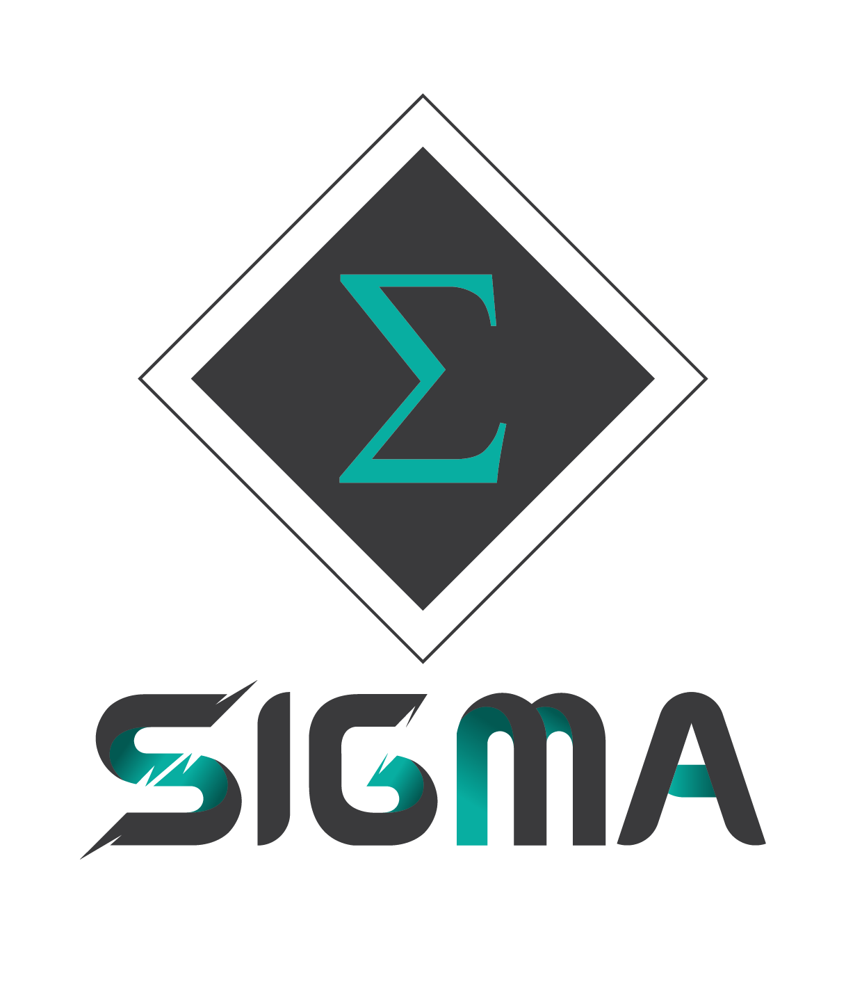
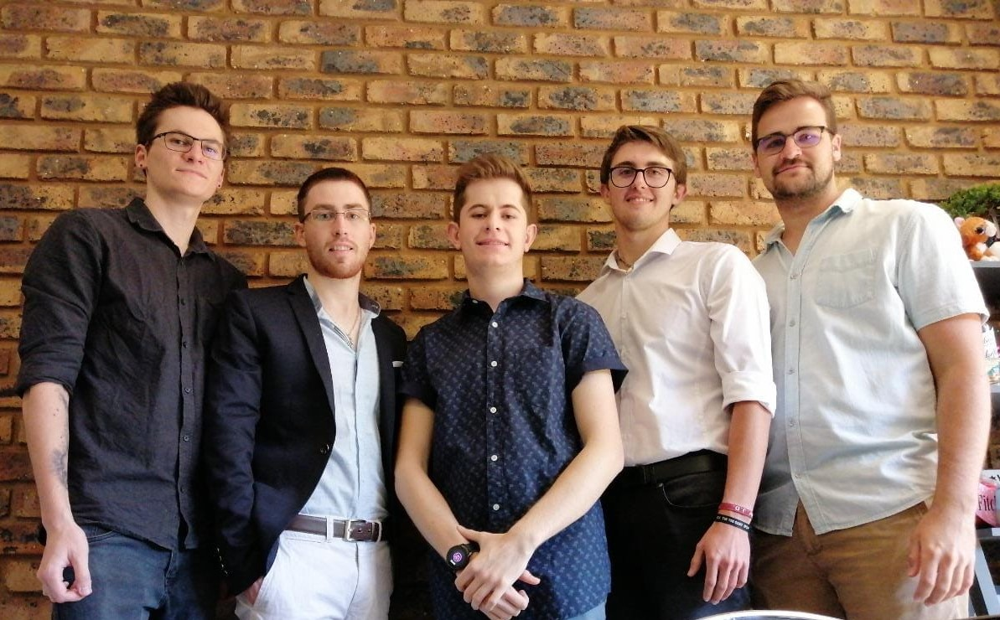

<a href="https://github.com/COS301-SE-2020/Home-Security-System"></a>
# Argus - Home-Security-System

Our Clients at EPI-USE Labs tasked us (Team Sigma, a group of 5 students for our COS301 final year project) with designing a Home Security System called Argus. Argus is a multi-platform web application capable of instantly identifying threats on multiple camera feeds around a one's home whilst also notifying them in real time either via Email or SMS of any potential threats picked up by the system. As a constraint, our clients wanted us to run the the facial detection on a Raspberry Pi. This ensured that if a new home owner came along wanting to use the web application, he/she would only be required to purchase a Raspberry Pi along with "X" number of Camera's to set up around his/her home. Argus relies solely on open source software and is loosely coupled so that any component of the system could be replaced relatively easily if so desired. Finally, Argus was built using a Role-based access control approach thus depending on the user's permissions (Admin/Advanced/Basic) he/she would have more or less capabilities grated by the system. We as Team Sigma accomplished all of this using an Agile methodology with daily stand-ups and biweekly sprints.

## Visit Argus
 [Argus WebApp (Heroku)](https://sigma-argus.herokuapp.com/)

## Documentation
 [Software Requirements Specification](/Documentation/Sigma_SRS_Document_Final.pdf)

 [User Manual](/Documentation/Argus_User_Manual_v3.pdf)

 [Coding Standards](/Documentation/Sigma__Coding_Standards_document.pdf)

 [Technical Installation Manual](/Documentation/Technical_Installation_Manual.pdf)

 [Testing Policies](/Documentation/Testing_Policies.pdf)

## Project Management

 [Project Management Tool (ClickUp)](https://app.clickup.com/2535636/v/l/s/2669690)

 [ClickUp Schedule](https://share.clickup.com/c/h/2dc6m-169/098ad26309043f3)

## Demo Videos

 [Demo 1](https://drive.google.com/file/d/1QlzzfJBzulz0C5Vk_K-gsIZmKuGH15zq/view?usp=sharing)

 [Demo 2](https://drive.google.com/file/d/1twylM62yNvclUM6zKJeOSxo46HInaMkH/view?usp=sharing)

 [Demo 3](https://drive.google.com/file/d/1nmYSEZ-q6KomuUadqy5R1eBndgRQRk0M/view?usp=sharing)

 [Demo 4](https://drive.google.com/file/d/14zL797nATDfY3vd2i8kUvGWcfuFuDsPq/view?usp=sharing)

## Final System Videos
 [Core Functionality](https://drive.google.com/file/d/1wXCngEVF078hRrkpI6vbqUHSAwRlXIJr/view?usp=sharing)

 [Full System](https://drive.google.com/file/d/1WjClfpGbzwVZtbOzLiPzTJDouzFqa5kg/view?usp=sharing)

## Repository Layout
```
master 
└── neuralnetwork
└── postgreCRUD
    └── springSessions
    └── smtpBackend
└── firebase-Master
    └── firebaseFrontEnd
└── testing
└── deployables
    └── deploy
    └── heroku
```

## Technologies Used: 

- Heroku Server (Free Tier)
- Angular for frontend development with a combination of JavaScript and TypeScript backend
- Spring Boot for backend development
- Python for the Neural Network facial detection, which ran on a Raspberry Pi4 Model B
- RabbitMQ/CloudAMQL as the Message Broker
- PostgreSQL as the Database

# Meet the Team



## Group Members

### Britney Chu (u18176951) 

<a href="https://github.com/BritneyChu"></a>
<a href="https://britneychu.github.io/"></a>
<a href="https://www.linkedin.com/in/britney-chu-ab434a1a3/"></a>


Previous Team Leader, unfortunately she had to drop out of the degree due to medical/health reasons.

<details><summary>Expand details</summary>
<div class="right">

**Interests:**
    - Programming       - Project management
    
    - System analysis   - Website design


**Skills:**
    - Systems Architecture              - Machine Virtualisation software
    
    - XAMPP with APACHE and FileZilla   - PHPmyAdmin           
    
    - Draw.io                           - C++, Java, Delphi
    
    - HTML, CSS and Bootsrap            - PHP, Javascript with AJAX and ES6  
    
    - XML, and XML schema creation      - Low-level Assembly Language(x86)
    
    - Python                            - Android

**Previous work experience:**

* **Creator of Delphi single-task programs**  
Merensky High School, Limpopo

* **Tutoring**  
Milky Way Tutors, Computer Science

**Attitudes:**

    - Adventurous        - Passionate        - Artistic
    
    - Creative           - Experimental      - Logical
</div>

</details>

### Brad Zietsman (u15228194)
#### Team Leader
<a href="https://github.com/Bradford-700"></a>
<a href="https://bradford-700.github.io/online-cv"></a>
<a href="https://www.linkedin.com/in/brad-zietsman/"></a>


<details><summary>Expand details</summary>

- __Interests__: Chess, Coding, Dancing, Gym, Gaming, Rugby, Traveling.
- __Skills__: C++, C#, Java, Python, x86 Assembly, PHP, JavaScript, HTNL/CSS, MySQL, Postgre, MongoDB, Neo4j.
- __Previous work experience__: Tutor for COS212 at the University of Pretoria.
- __Attitudes__: Confident, Attention to Detail, Enjoys Challenges, Hard Worker, Logical, Problem Solving, Team-driven.

</details>

### Brett Fourie (u16024002) 
<a href="https://github.com/BrettFourie"></a>
<a href="https://brettfourie.github.io/online-cv/"></a>
<a href="https://www.linkedin.com/in/brett-fourie-949021192/"></a>


<details><summary>Expand details</summary>

- __Interests__: Gym, Gaming, Technology and Reading
- __Skills__:  Java, C++, x86 Assembly, HTML, CSS, JavaScript, PHP, Android Development and UI/UX Design
- __Previous Work Experience__: No formal work experience
- __Attitudes__: Hard working, positive, dedicated and punctual, 

</details>

### Jason Lutz (u15323413)
<a href="https://github.com/jay-lutz"></a>
<a href="https://jay-lutz.github.io"></a>
<a href="https://www.linkedin.com/in/jason-lutz-36058b159/"></a>


<details><summary>Expand details</summary>

- __Interests__: Gaming, Gym, Virtual Reality, Guitar
- __Skills__: Python, Java, C++, Javascript, HTML, x86 Assembly
- __Previous work experience__: Volunteer work developing chat bots
- __Attitudes__: Positive, Dedicated, Relaxed, Determined

</details>

### Johann Stadler (u16008554)
<a href="https://github.com/JohannSS"></a>
<a href="https://johannss.github.io/my_online_CV"></a>
<a href="https://www.linkedin.com/in/johann-stadler-0064251a9/"></a>


<details><summary>Expand details</summary>

- __Interests__: Trail running, Motor sports, CNC machining, 3D printing
- __Skills__: Java, C++, Assembler, HTML, CSS, JavaScript, Android and MySQL
- __Previous work experience__: No formal work experience, 5 years of University level programming experience.
- __Attitudes__: Dedicated, Hard Worker, Perfectionist, Creative and Positive.

</details> 

### Shaun Vermeulen (u16078625)
<a href="https://github.com/ShaunVermeulen"></a>
<a href="https://shaunvermeulen.github.io"></a>
<a href="https://www.linkedin.com/in/shaun-vermeulen-a617161a4"></a>


<details><summary>Expand details</summary>

- __Interests__: Gaming, Fishing, Camping
- __Skills__: Java, C++, HTML, CSS, PHP, x86 Assembly, Android, MySQL
- __Previous work experience__: No formal work experience. I am currently a student at the University of Pretoria enrolled for BSc Computer Science
- __Attitudes__: Determinated, Positive, Hard Working, Dedicated 

</details> 

## Contributions

### Brad Zietsman (u15228194)
- Team management and Intergration
- Frontend (Angular)
    - Security
    - CRUD Operations
    - Logic Operations
- Backend (Spring Boot)
    - CRUD Operations
    - Security
    - RabbitMQ/CloudAMQP
    - Unit/Intergrations tests
- Neural Network (Python)
    - Facial Detection
    - Video Capture
- Database Management (PostgreSQL)
    - Liquibase
- Server Setup/Configuration (Heroku)
    
### Shaun Vermeulen (u16078625)
Frontend (Angular)
    - CRUD operations
    - Logic Operations
    - Session Management
    - Sending Email's (SMTP)
    - Password Recovery
    - Graphs
    - Unit/Intergration Tests
- Backend (Spring Boot)
    - Sending Email's (SMTP)
    - Sending SMS's (Twilio)
- Risk Management (Firebase)
    
### Brett Fourie (u16024002)
- Frontend (Angular)
    - CRUD Operations
    - Security
    - Cross-platform implementation (Desktop, Tablet, Mobile)
    - UI Design

### Johann Stadler (u16008554)
- Frontend (Angular)
    - CRUD Operations
    - Logic Operations
    - Graphs
    - UI Design
    
### Jason Lutz (u15323413)
- Neural Network (Python)
    - Facial Detection
    - Facial Classification
    - Facial Recognition
    - RabbitMQ/CloudAMQP (Pika)
    - Camera feed to Server
    - Port forwarding
    - Unit/Intergration Tests
    
